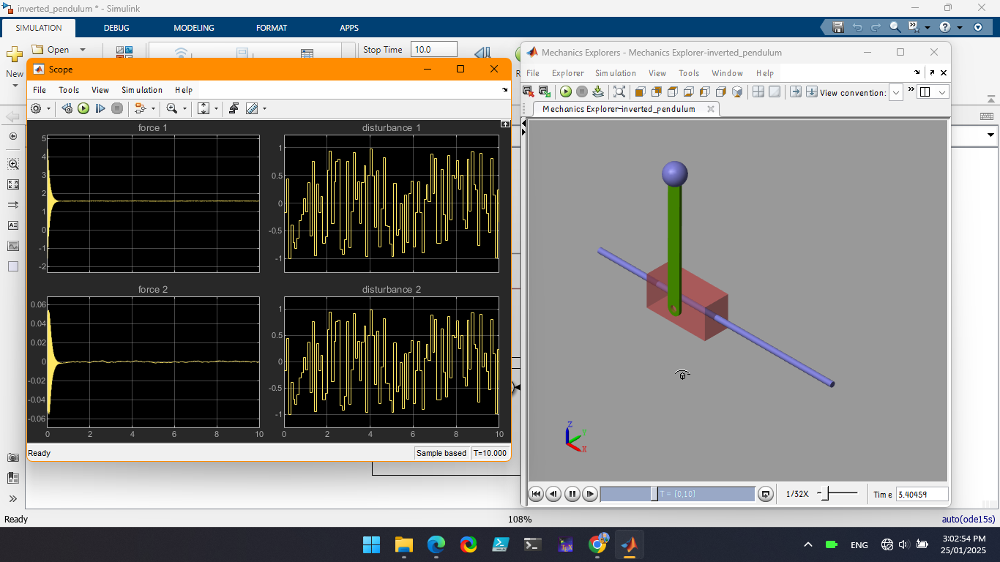

# Self-Balancing Inverted Pendulum Simulation

Welcome to the Self-Balancing Inverted Pendulum Simulation project! This repository contains the MATLAB/Simscape files and documentation to simulate a self-balancing inverted pendulum.

## Table of Contents
- [Introduction](#introduction)
- [Features](#features)
- [Model Picture](#model-picture)
- [Software Requirements](#software-requirements)
- [Installation](#installation)
- [Usage](#usage)
- [Contributing](#contributing)
- [License](#license)
- [Acknowledgements](#acknowledgements)

## Introduction
The Self-Balancing Inverted Pendulum Simulation is an educational project that demonstrates the principles of control systems and dynamic stability. The simulation is developed using MATLAB and Simscape to model and analyze the behavior of an inverted pendulum system.

## Features
- Real-time balance control simulation using a gyroscope and accelerometer model
- PID control for stable and responsive performance
- Visualization of the pendulum's motion and control response
- Adjustable control parameters for experimentation
- Open-source code and simulation models

## Model Picture
Here is a picture of the complete model:

  

<em>Figure 1: Demonstration of the self balancing inverted pendulum on simscape .</em>

## Software Requirements
- MATLAB (R2020a or later)
- Simscape (Add-on for MATLAB)
- Control System Toolbox (Add-on for MATLAB)
- Optional: Simulink (for advanced simulation features)

## Installation
Clone this repository to your local machine:
`git clone https://github.com/sployal/Self_balancing_invertedpendulum`

## Usage
Follow these steps to run the simulation:
1. Open MATLAB.
2. Navigate to the repository folder.
3. Open the Simscape model file (`.slx`).
4. Run the simulation.

## Contributing
Contributions are welcome! Please fork this repository and submit a pull request for any improvements or additions.

## License
This project is licensed under the MIT License - see the [LICENSE](LICENSE) file for details.

## Acknowledgements
Special thanks to the contributors and the open-source community for their support and resources.

